# VSCode Beautification

## 1) Extensions

You need to make sure you have these extensions installed for the beautification process.

* [Better Comments](https://marketplace.visualstudio.com/items?itemName=aaron-bond.better-comments)
* [Brackets Pair Colorizer 2](https://marketplace.visualstudio.com/items?itemName=CoenraadS.bracket-pair-colorizer-2)
* [EditorConfig](https://marketplace.visualstudio.com/items?itemName=editorconfig.editorconfig)
* [ESlint](https://marketplace.visualstudio.com/items?itemName=dbaeumer.vscode-eslint)
* [Format HTML in PHP](https://marketplace.visualstudio.com/items?itemName=rifi2k.format-html-in-php)
* [Highlight Matching Tag](https://marketplace.visualstudio.com/items?itemName=vincaslt.highlight-matching-tag)
* [LintHTML](https://marketplace.visualstudio.com/items?itemName=kamikillerto.vscode-linthtml)
* [PHPCS](https://marketplace.visualstudio.com/items?itemName=ikappas.phpcs)
* [PHPCBF](https://marketplace.visualstudio.com/items?itemName=persoderlind.vscode-phpcbf)
* [Prettier](https://marketplace.visualstudio.com/items?itemName=esbenp.prettier-vscode)
* [Save and Run](https://marketplace.visualstudio.com/items?itemName=wk-j.save-and-run)
* [Stylelint](https://marketplace.visualstudio.com/items?itemName=stylelint.vscode-stylelint)
* [TODO highlighter](https://marketplace.visualstudio.com/items?itemName=wayou.vscode-todo-highlight)

## Reqruied files for process

You need to make sure that these files are always there so that the beautification process can work. This contains multiple files from many different sources like Stylelint, ESLint, LintHTML, etc.

### List of all required files

* .editorconfig
* .eslintrc
* .linthtmlrc.json
* .phpcs.xml
* .prettierrc
* .prettierignore
* .stylelintrc
* .stylelintignore
* package.json
* composer.json
* .vscode/settings.json (Workspace)
* .settings.json (User)

## 2) Update Settings of VSCode

After that you need to update the VSCode setitngs so that references to plugins are correctly matched. This is required so that plugin files can be properly linked.

### Update Settings.json

#### PHPCS & PHPCBF

1) Make sure that the phpcs.bat and phpcs.bat are linked to the correct location. You just need to update the username for the current windows user in settings.json file.

``` jsonc
"phpcs.executablePath": "C:/Users/UserName/AppData/Roaming/Composer/vendor/bin/phpcs.bat",
"phpcbf.executablePath": "C:/Users/UserName/AppData/Roaming/Composer/vendor/bin/phpcbf.bat",
```

2) If you have an old setup that contains the file called `phpcs.xml.dist`, then you need to rename it to `.phpcs.xml`. But if you don't want to do this, then you need to proerly link the file in settings.json and after that make sure to check that it is properly being called and working properly.
You need to update these settings to change it.

``` jsonc
  "phpcs.standard": "./phpcs.xml",
  "phpcbf.standard": "./phpcs.xml",
```

### 3) Update PC Settings

There are some settings that are required to be changed so that the beautification process can work properly. Here is list of those things.

#### a) Enable running scripts

When you try to use the `stylelint` it gives an error saying that *stylelint cannot be loaded because running scripts is disabled on this system*. You need to run this command in PowerShell(Admin) to enable running scripts.

``` powershell
Set-ExecutionPolicy -ExecutionPolicy Unrestricted
```

After that you need to select `[A] Yes to All` option from the given prompt.

``` 
[Y] Yes  [A] Yes to All  [N] No  [L] No to All  [S] Suspend  [?] Help (default is "N"):
```
That's it the execution policy has been updated now the commands will run properly.

If you have any old settings that can be found in `settings.json` file that looks like this

``` jsonc
"terminal.integrated.shellArgs.windows": ["-ExecutionPolicy", "Bypass"]
```

That will not work anymore. You need to update it by deleting it from `settings.json` file and execute the command in `PowerShell` to make this happen.

### 4) Installations

Here is a detailed overview of what needs to be installed and configured in order to all of this work.

#### a. PHP Setup 🚧

<span id="php-installation-setup"></span>

##### a. Installing PHP on Windows 🔧

* Go to *Google* and search for *php download* (Or  goto this link https://www.php.net/downloads.php)
* Select `Windows downloads`
* Select *Non Thread Safe* `Zip` file based on your system architecture *x86* | *x64* 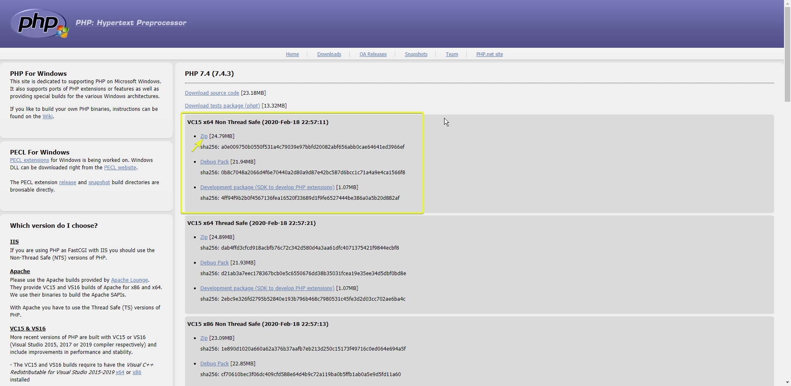
* Now goto *C* drive and make a new folder names `php`
* Extract the downloaded zip file into this folder.
* After that rename the file named `php.ini-development` &rightarrow; `php.ini`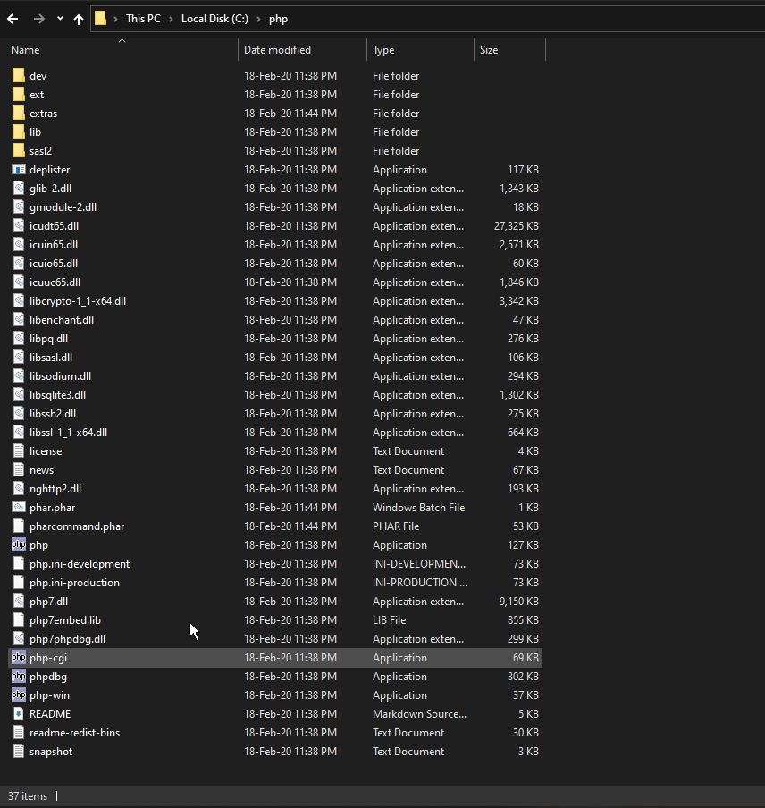
* Now press windows button and search for `environment variables` and press *enter*. After that again click on `Environment Variables` button in the opened window.
* In `System variables` find `Path` variable and open it.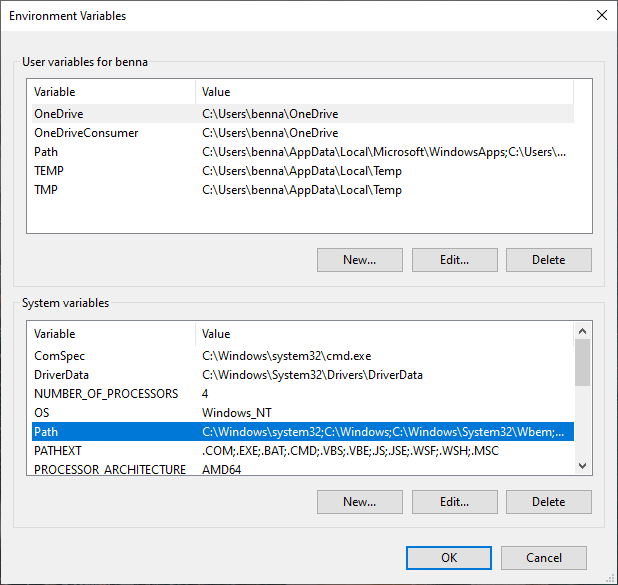
* Now click on *New* and enter the php folder path. That should usually be `C:\php` if you have not placed it somewhere else.
* Click `OK` then `OK` and again `OK` to close and save all windows.

##### b. Check PHP Installation 🏁

* Press `Win+R` to open *Run* window.
* Type `cmd` to open the *Command line*.
* Type `php -v` and press enter. You should get the information of php version installed. 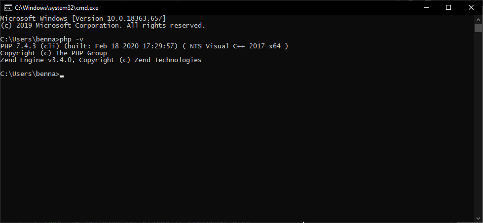
* If you unfortunately get somethings like this `'php' is not recognized as an internal or external command operable program or batch file.`. Then please go through the [PHP installation setup](#php-installation-setup) again.

#### 2. Composer 🎼

##### a. Installing Composer

* Goto Google and search for composer (or go to this site https://getcomposer.org/)
* Click on Download button
* For Windows click on `Composer-Setup.exe` link to download EXE file. After downloading run the setup.
* The setup will find the installation of PHP in your PC. If it finds one it will provide the path to it confirming it has found. Else you need to [install PHP first](#php-installation-setup).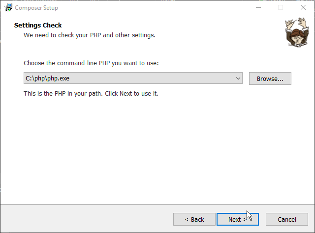
* For the option of updating `php.ini` file. Go ahead and do that.

> ⚠️ ***Note*** Don't enable `Developer Mode` during installation.

##### b. Checking Composer Installation

* Press `Win+R` to open *Run* window.
* Type `cmd` to open the *Command line*.
* Type `composer` and press enter in CMD. You should get details of Composer. This means you have installed it properly. 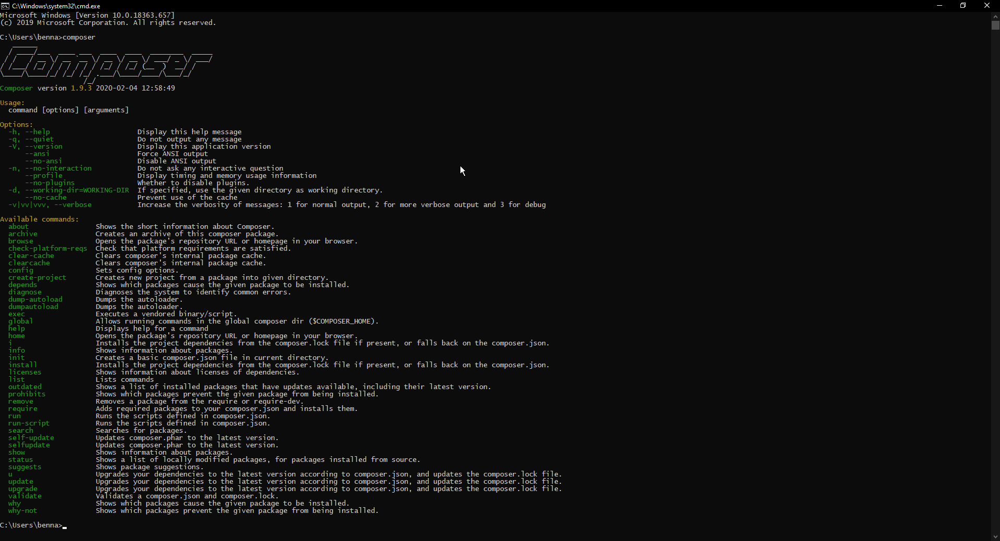

##### c. Adding Composer Packages Globally

> ***Note*** Composer is a framework. To get work out of it you need to install that specific packages according to your needs. Here are some packages that you need to install for the current process.

* Press `Win+R` to open *Run* window.
* Type `cmd` to open the *Command line*.
* Now type these commands one by one to install these packages globally on the computer. You should get output like this confirming each installation.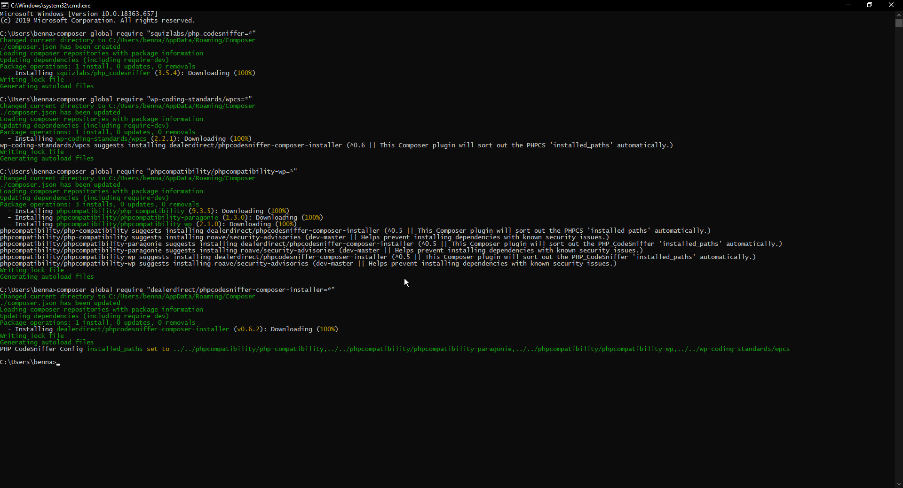
  * PHP_CodeSniffer - `composer global require "squizlabs/php_codesniffer=*"`
  * WordPress Coding Standards - `composer global require "wp-coding-standards/wpcs=*"`
  * PHPCompatibility - `composer global require "phpcompatibility/phpcompatibility-wp=*"`
  * Code Sniffer Composer - `composer global require "dealerdirect/phpcodesniffer-composer-installer=*"`
  * WPThemeReview Standard for PHP_CodeSniffer - `composer global require wptrt/wpthemereview dealerdirect/phpcodesniffer-composer-installer=*"`
* Now type command `phpcs -i` to get information related to PHPCS packages. You should get a list of installed standard for PHPCS like this including all of the above installed ones. 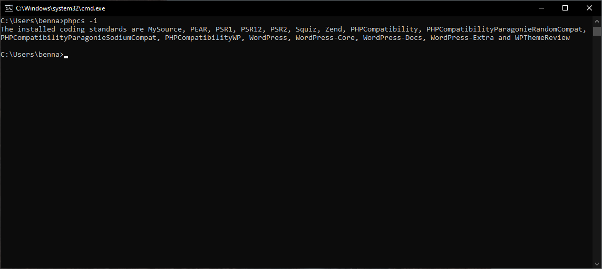
* The output should look like this.
```
The installed coding standards are MySource, PEAR, PSR1, PSR12, PSR2, Squiz, Zend, PHPCompatibility, PHPCompatibilityParagonieRandomCompat, PHPCompatibilityParagonieSodiumCompat, PHPCompatibilityWP, WordPress, WordPress-Core, WordPress-Docs, WordPress-Extra and WPThemeReview
```

* This confirms that the packages are installed correctly. We can move onto next ste

#### 3. Update Composer VSCode User Paths

> ***Note*** In this process you need to update paths of 2 `.bat` files in VSCode that are related to Composer &rightarrow; PHPCS

* Open VSCode and goto settings by pressing `Ctrl+,`
* You should see two types of *User* related settings. The settings below should be applied to both of these settings.
  * 1. User Settings
  * 2. Workspace settings
* Go to `phpcs.executablePath` and update it like this manner. `C:/Users/USERNAME/AppData/Roaming/Composer/vendor/bin/phpcs.bat` 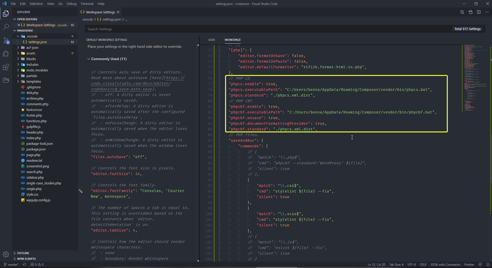
* You need to update the path of two paths as show in the picture above.
  * PHPCS
  * PHPCBF
* To confirm the paths are right, just copy the path and paste into new tab of *Chrome* and press enter.
* You should see some output like this *(instead of 404 Not Found Error)* confirming you have right path to that file.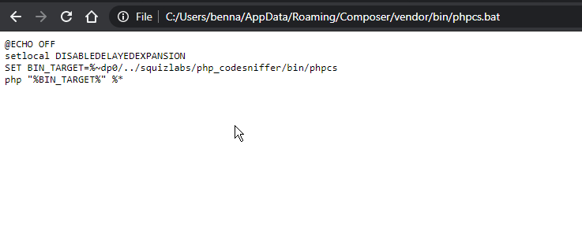
* Do this for both `.bat` files path.

#### 4. NodeJS

##### a. Installation of NodeJS

* Go to *Google* and search for NodeJS (or goto this link https://nodejs.org/en/)
* Click to download `LTS` version of NodeJS.
* Open the setup and install as usual setup file.

##### b. Checking NodeJS Installation

* Press `Win+R` to open *Run* window.
* Type `cmd` to open the *Command line*.
* Type `node -v` in CMD and press enter. You should see the installed version number of NodeJS. 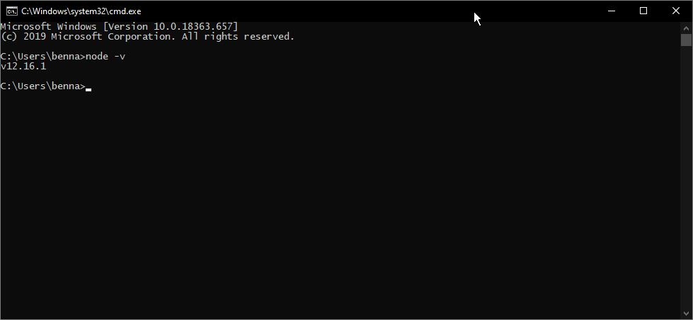

##### c. Installing Modules of NodeJS

> ***Note*** NodeJS is a framework. To get work out of it you need to install that specific modules according to your needs. Here are some modules that you need to install for the current process.

* Press `Win+R` to open *Run* window.
* Type `cmd` to open the *Command line*.
* You need to install some modules globally by running the commands provided below.
  *  install ESLint globally - `npm i eslint -g`
  *  install StyleLint globally - `npm i stylelint -g`
  *  install Prettier globally - `npm i prettier -g`
*  After that run this command `npm list -g --depth 0` in same windows ro confirm all modules are installed correctly. If you see something like this you are good to go. <br/>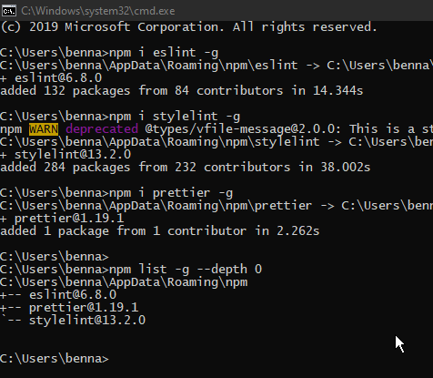

#### 5. Checking everything in VSCode

> ***Note*** You need to check that everything you installed, is properly integrated into VSCode as well. So we'll be running some commands we ran earlier in CMD, now in VSCode to check the output in that.

##### a. Checking Workspace code.

* Open VSCode.
* Open VSCode settings by pressing `Ctrl+,`
* You should see two types of *User* related settings. The settings below should be applied to both of these settings.
  * 1. User Settings
  * 2. Workspace settings
* Here are some commands that you need to make sure are not commented out. Else these commands will not run and your beautification process will not work.
*  

###### 1) For HTML

``` jsonc
// HTML Settings
 "[html]": {
    "editor.formatOnSave": true,
    "editor.formatOnPaste": true,
    "editor.defaultFormatter": "esbenp.prettier-vscode"
  },
```

###### 2) For CSS / SCSS

``` jsonc
 // CSS Beautification
  "css.validate": false,
  "less.validate": false,
  "scss.validate": false,
  "stylelint.enable": true,
  "stylelint.validate": ["css", "scss"],
  "[css]": {
    "editor.formatOnSave": true,
    "editor.formatOnPaste": true,
    "editor.defaultFormatter": "esbenp.prettier-vscode"
  },
  "[scss]": {
    "editor.formatOnSave": true,
    "editor.formatOnPaste": true,
    "editor.defaultFormatter": "esbenp.prettier-vscode"
  },
```

###### 3) For JS, jQuery, ReactJS etc

``` jsonc
	// JavaScript/jQuery/ReactJS Beautification
  "[javascript]": {
    "editor.formatOnSave": false,
    "editor.formatOnPaste": false
    // "editor.defaultFormatter": "HookyQR.beautify"
  },
  "[json]": {
    "editor.formatOnSave": true,
    "editor.formatOnPaste": true,
    "editor.defaultFormatter": "esbenp.prettier-vscode"
  },
  "[jsonc]": {
    "editor.defaultFormatter": "esbenp.prettier-vscode"
  },
  "[javascriptreact]": {
    "editor.defaultFormatter": "vscode.typescript-language-features"
  },
  "eslint.format.enable": true,
  "eslint.alwaysShowStatus": true,
  "eslint.validate": [
    "javascript",
    "javascriptreact",
    "html",
    "typescriptreact"
  ],
  "editor.codeActionsOnSave": {
    "source.fixAll.eslint": true
  },
```

###### 4) For PHP

``` jsonc
  // PHP Beautification
  "[php]": {
    "editor.formatOnSave": true,
    "editor.formatOnPaste": true,
    "editor.defaultFormatter": "persoderlind.vscode-phpcbf"
  },
  // WPCS
  //PHP CS
  "phpcs.enable": true,
  "phpcs.executablePath": "C:/Users/UserName/AppData/Roaming/Composer/vendor/bin/phpcs.bat",
  // "phpcs.standard": "./phpcs.xml",
  //PHP CBF
  "phpcbf.enable": true,
  "phpcbf.executablePath": "C:/Users/UserName/AppData/Roaming/Composer/vendor/bin/phpcbf.bat",
  "phpcbf.onsave": true,
  "phpcbf.documentFormattingProvider": true,
  //   "phpcbf.standard": "./phpcs.xml",
  // PHP Files.
```

###### 5) Save & Run Commands

These commands run when you save a file. You need to enable these in the settings file. If for some reasons you need to disbale any of it for some time, you can comment that specific file related command. Make sure to re-enable it afterwards.

``` jsonc
"saveAndRun": {
    "commands": [
      {
        "match": "\\.php$",
        "cmd": "phpcbf --standard='WordPress' ${file}",
        "silent": true
      },
      {
        "match": "\\.css$",
        "cmd": "stylelint --fix ${file}",
        "silent": true
      },
      {
        "match": "\\.scss$",
        "cmd": "stylelint --fix ${file}",
        "silent": true
      }
        {
          "match": "\\.js$",
          "cmd": "eslint ${file} --fix",
          "silent": true
        }
    ]
  },
```

#### 5. Testing Beautification

> ***Note*** To check the beautification process you need to open up each type of supported files and try to save them. The commands will run on save and will beautify the code.

> The commands will run silently. But if you want to confirm that a command ran on this file. Simply goto `Terminal` and find for `powershell` in dropdown list. You will be able to find somethings like this, check for the last command that ran it should be on your opened file.<br/> 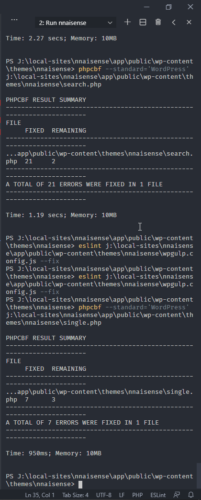


### a. Supported File Types

* HTML Files
* CSS / SCSS Files
* PHP Files
* JS Files

### b. Some Pointers

* You may get some notification like this depending on file size. If file size is smaller the notification may be not visible or visible for many less amount of time.<br/> 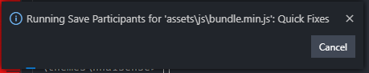
* You can check the `Problems` panel to see the possible errors before and efter the `linting` or `beautification` process. 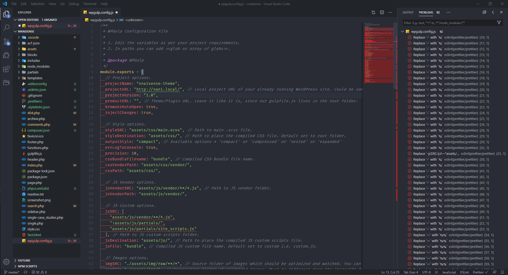
* There are some errors that requires human interaction for manually resolving them. Those type of errors will not be resolved by any linter but those will be visibie in problems panel.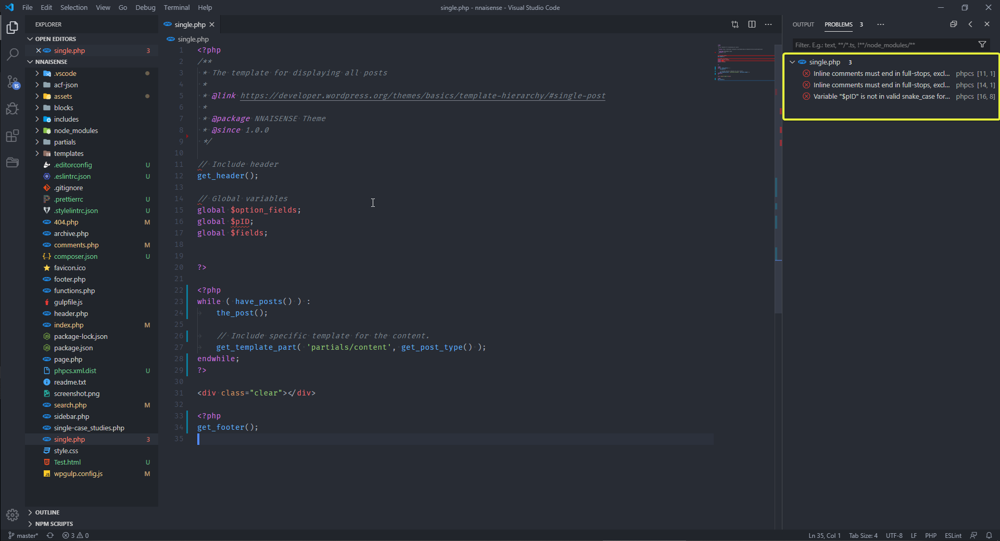
